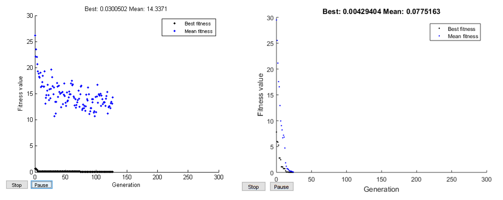

# crystalAligner
crystalAligner is a computer program for alignment of crystals in a scanning electron microscope. Given one or two crystal orientations (obtained from i.e. EBSD), one or two crystal directions and associated axes of the microscope coordinate system as alignment objectives, the program optimizes the alignment of the crystal(s) with the microscope coordinate system by global optimization under the constraints of available rotational axes and limits of the microscope stage. 

**crystalAligner** uses [**MATLAB**](https://mathworks.com/products/matlab.html) and the **MATLAB**-based crystallographic toolbox [**MTEX**](https://mtex-toolbox.github.io) under the hood and it therefore utilize crystal symmetries. Furthermore, the determination of the best stage rotation angles is realized with a [**heuristic optimization algorithm**](https://mathworks.com/discovery/genetic-algorithm.html) which is robust in finding the global optimum. The crystal alignment can therefore often be optimized to a satisfactory degree even in the case of a standard microscope stage with two rotation axes. 

A scientific treatment of the crystallographic aspects and the optimization procedure can be found in the associated [*research paper*](./doc/crystalAligner_researchPaper_2020.pdf). If you like **crystalAligner** and apply it for your research I would appreciate a citation.

## Installation and execution of crystalAligner
The program was developed in [**MATLAB**](https://mathworks.com/products/matlab.html) and requires the installation of the crystallographic texture analysis toolbox [**MTEX**](https://mtex-toolbox.github.io) as well as the [**MATLAB global optimization toolboxes**](https://mathworks.com/products/global-optimization.html). The global optimization toolbox often comes preinstalled with MATLAB or can be obtained separately. If you are not having the toolbox installed, **crystalAligner** will return an error message related to this. **MTEX**  can be downloaded free of charge and instructions can be found in the [video below](https://youtu.be/SsiDFqqqZU4). **crystalAligner** has been tested with MTEX versions 4.2.1 to 5.6.0 and MATLAB versions R2014a to R2020a.

To run **crystalAligner** open **MATLAB**, navigate to one of the example scripts and execute it. The example script automatically adds the required subdirectories to the **MATLAB** path. For your own problems it is recommended to make a copy of an example script and adapt it to your setup and optimization problem. Follow some of the examples below to learn how to work with **crystalAligner**.

[*How to install MTEX*](https://youtu.be/SsiDFqqqZU4)

#### Possible convergence issues in older MATLAB versions
*If you run a MATLAB version that is older than R2016b you may experience convergence problems in the case of single objective optimization which uses the [ga](https://se.mathworks.com/help/gads/ga.html?s_tid=srchtitle) function. The older version of [ga](https://se.mathworks.com/help/gads/ga.html?s_tid=srchtitle) is more likely to run into local minima, which can be somewhat mitigated by increasing the initial population size (try increasing the initial population size from 100 to 200 in examples 1 and 4). Multiobjective optimization problems using gamultiobj are not affected by this. Below an example of this is shown, with the [ga](https://se.mathworks.com/help/gads/ga.html?s_tid=srchtitle) of the older and newer MATLAB versions left and right, respectively.*

  

## [Example 1](./cA_example_1.m)
Two equivalent crystal plane normals in a cubic crystal with Euler orientation [233 145 33] degrees are aligned in two separate single-objective optimization problems. The crystal could for example represent a ferrite grain in a steel sample. The optimization objective is to align the z-axis of the microscope with either of the {111} or {100} equivalent plane normals. The stage axes setup chosen here represents a standard stage of an FEI scanning electron microscope with chosen soft-limits in the tilt axis of 0 – 20° (the soft limit was chosen to enable further tilting of the aligned crystal for FIB milling). The genetic algorithm is set up to have a population size of 100 individuals. Optional text output for estimating the trench sizes for a FIB lift-out at an inclined surface may be activated. It is found that the {100} can be perfectly aligned while the optimal {111} alignment still deviates about 20° from ideal alignment, caused by the significant constraints by the SEM stage rotation limits (for MATLAB distributions <2016b an optimal solution with non-fulfilled linear constraints might be computed, as explained [here](https://github.com/frankNiessen/crystalAligner/blob/master/README.md#possible-convergence-issues-in-older-matlab-versions). 

The expected output is:

**Optimization problem 1:**
- Rotation around microscope X-axis: 19.9°
- Rotation around microscope Z-axis: -44.6°
- Deviation from ideal alignment in Z-axis: 19.8 °

**Optimization problem 2:**   
- Rotation around microscope X-axis: 15.0°
- Rotation around microscope Z-axis: 133.1°
- Deviation from ideal alignment in Z-axis: 0.0 °

## [Example 2](./cA_example_2.m)
This case is equivalent to application example 1 in the [*research paper*](./doc/crystalAligner_researchPaper_2020.pdf). Here, two equivalent crystal directions in a cubic crystal with Euler orientation [61 42 9] are aligned simultaneously. In this specific application, the crystal represents a β-phase grain in a Ti alloy. The optimization objectives are to align the y-axis of the microscope with any of the **[113]** equivalent crystal directions and the z-axis of the microscope with any of the **[110]** equivalent crystal directions. As in [example 1](./cA_example_1.m) The stage axes represent a standard stage of an FEI scanning electron microscope with chosen soft-limits in the tilt axis of 0 – 20°. The genetic algorithm is set up to have a population size of 100 individuals and no weighting factors applied to the objectives for the choice of the optimal solution. Optional text output for estimating the trench sizes for a FIB lift-out at an inclined surface and plotting of graphs are activated.

The expected output is:

**Optimization problem 1:**
- Rotation around microscope X-axis: 19.9°
- Rotation around microscope Z-axis: -44.6°
- Deviation from ideal alignment in Z-axis: 19.8 °

**Optimization problem 2:**   
- Rotation around microscope X-axis: 15.0°
- Rotation around microscope Z-axis: 133.1°
- Deviation from ideal alignment in Z-axis: 0.0 °

