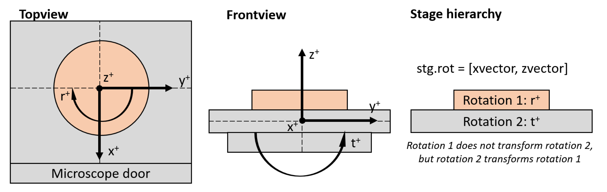

| [*How to use*](https://github.com/frankNiessen/crystalAligner/blob/master/README.md#how-to-use) 
| [*Fundamentals*](https://github.com/frankNiessen/crystalAligner/blob/master/README.md#fundamentals) 
| [*Example scripts*](https://github.com/frankNiessen/crystalAligner/blob/master/README.md#example-scripts) |

# crystalAligner
**crystalAligner** is a computer program for alignment of crystals in a scanning electron microscope. Given one or two crystal orientations (obtained from i.e. EBSD), one or two crystal directions and associated axes of the microscope coordinate system as alignment objectives, the program optimizes the alignment of the crystal(s) with the microscope coordinate system by global optimization under the constraints of available rotational axes and limits of the microscope stage. 

**crystalAligner** uses [**MATLAB**](https://mathworks.com/products/matlab.html) and the **MATLAB**-based crystallographic toolbox [**MTEX**](https://mtex-toolbox.github.io) under the hood and it therefore utilize crystal symmetries. Furthermore, the determination of the best stage rotation angles is realized with a [**heuristic optimization algorithm**](https://mathworks.com/discovery/genetic-algorithm.html) which is robust in finding the global optimum. The crystal alignment can therefore often be optimized to a satisfactory degree even in the case of a standard microscope stage with two rotation axes. 

A scientific treatment of the crystallographic aspects and the optimization procedure can be found in the associated [*research paper*](./doc/crystalAligner_researchPaper_2020.pdf). If you like **crystalAligner** and apply it for your research I would appreciate a citation.

## How to use
The program was developed in [**MATLAB**](https://mathworks.com/products/matlab.html) and requires the installation of the crystallographic texture analysis toolbox [**MTEX**](https://mtex-toolbox.github.io) as well as the [**MATLAB global optimization toolboxes**](https://mathworks.com/products/global-optimization.html). The global optimization toolbox often comes preinstalled with MATLAB or can be obtained separately. If you are not having the toolbox installed, **crystalAligner** will return an error message related to this. **MTEX**  can be downloaded free of charge and instructions can be found in the [video below](https://youtu.be/SsiDFqqqZU4). **crystalAligner** has been tested with MTEX versions 4.2.1 to 5.6.0 and MATLAB versions R2014a to R2020a.

To run **crystalAligner** open **MATLAB**, navigate to one of the example scripts and execute it. The example script automatically adds the required subdirectories to the **MATLAB** path. For your own problems it is recommended to make a copy of an example script and adapt it to your setup and optimization problem. Follow some of the examples below to learn how to work with **crystalAligner**.

[*How to install MTEX*](https://youtu.be/SsiDFqqqZU4)

#### Possible convergence issues in older MATLAB versions
*If you run a MATLAB version that is older than R2016b you may experience convergence problems in the case of single objective optimization which uses the [ga](https://se.mathworks.com/help/gads/ga.html?s_tid=srchtitle) function. The older version of [ga](https://se.mathworks.com/help/gads/ga.html?s_tid=srchtitle) is more likely to run into local minima, which can be somewhat mitigated by increasing the initial population size (try increasing the initial population size from 100 to 200 in examples 1 and 4). Multiobjective optimization problems using gamultiobj are not affected by this. Below an example of this is shown, with the [ga](https://se.mathworks.com/help/gads/ga.html?s_tid=srchtitle) of the older and newer MATLAB versions left and right, respectively.*

  

## Fundamentals
It is easiest to follow the [examples](https://github.com/frankNiessen/crystalAligner/blob/master/README.md#example-scripts) to learn how to use **crystalAligner**. However, when working on your own crystal systems, orientations, alignment objectives and microscopes you will need to know how to set up **crystalAligner** properly. I will therefore go through all parameters that can be defined in the header of the [example scripts](https://github.com/frankNiessen/crystalAligner/blob/master/README.md#example-scripts).

#### Crystal alignment objective
This section specifies the crystal and specimen symmetries, the orientation of your crystal, and of course the crystal directions and microscope axes that should be aligned in the optimization problem. You can define one or two alignment objectives, which are stored in the cell arrays *crys{1}* and *crys{2}*, respectively. Let's look at the fields that need to be specified:

- *SS*: This is the specimen symmetry, which can be specified as 'triclinic' or 'orthorhombic' by the MTEX command [specimenSymmetry](https://mtex-toolbox.github.io/specimenSymmetry.specimenSymmetry.html). 
- *CS*: This is the crystal symmetry, which needs a point group as an input. Here we also name the crystal symmetry by specifying the option 'mineral'. This is done with the MTEX command [specimenSymmetry](https://mtex-toolbox.github.io/crystalSymmetry.crystalSymmetry.html). In the case where not all unit axes have the same length, it is also important to state the unit vector lengths when defining the crystal symmetry.
- *ori*: This is the crystal orientation. It uses the specimen and crystal symmetry as an input. The crystal orientation is usually defined by a set of three Euler angles, which can readily be extracted from EBSD data. There are however plenty of different ways of defining an [orientation](https://mtex-toolbox.github.io/orientation.orientation.html) in MTEX, which you are welcome to use as well.
- *alignAx*: This is a direction in the specimen coordinate system which is defined as a [vector3d](https://mtex-toolbox.github.io/vector3d.vector3d.html) instance in MTEX. In the most common cases you will want to align your crystal with the x, y or z directions of your microscope, in which case you can use the global MTEX variables *xvector*, *yvector* and *zvector*.
-  *Miller*: This specifies the crystal direction of crystal plane normal that should be aligned. In MTEX, this is done by using the [Miller](https://mtex-toolbox.github.io/Miller.Miller.html) object. The object simply requires the *Miller* indicees, the crystal and specimen symmetries, as well as the option 'hkl' or 'uvw' to specify plane normals or directions, respectively. In the case of *Miller-Bravais* notation using four indecees, the *hkil* or *UVTW* are valid options to declare crystal plane normals or directions, respectively. You can define multiple crystal directions by concatenating Miller objects like [Miller1,Miller2,Miller3]. This will sequentially solve multiple optimization problems and is only allowd for the first optimization objective. At last we set the option *Miller.opt.useSym* to *true* if we want to use the symmetrically equivalent directions or *false* if we only want to consider the specific direction.

#### Stage
This section specifies the rotation axes and limits of the specimen stage. The settings in the [example scripts](https://github.com/frankNiessen/crystalAligner/blob/master/README.md#example-scripts) work for a standard FEI SEM-stage (confirm this for yourself).
To demonstrate the concept of the hierarchy of rotation axes, we look at this sample in the image below. We have a [right-handed cartesian coordiante system](https://www.evl.uic.edu/ralph/508S98/coordinates.html) *x, y, z*. In the topview, looking down the optical column of the microscope, we can see that a rotation *r* is defined around *z*. The sketched clockwise rotation with positive sign is opposed to the definition of a positive rotation in a [right-hand coordinate system](https://www.evl.uic.edu/ralph/508S98/coordinates.html). In the front view, looking through the opening chamber door of the microscope, we see that a second rotation, tilt *t*, is defined around *x*. This time the rotation is anti-clockwise and therefore has a positive sign in the [right-hand coordinate system](https://www.evl.uic.edu/ralph/508S98/coordinates.html). We can see in the stage hierarchy *r* is labeled rotation 1 and *t* is labeled rotation 2. The numeration is done according to the order of the rotation axes from the upper to lowest. The first rotation only rotates the specimen while the second rotation rotates the specimen and the first rotation axis. This hierarchy can be extended to arbitrarily many rotation axes.

  

The rotation hierarchy is defined in the *stg* structure in the following way:
-  *rot*: List of the rotation axes in arbitrary order, in the above example these are: *[xvector; zvector]*.
-  *LB*: Lower bound. This defines the lower limits of the rotations, either in terms of the hard limits or personally chosen soft limits. In the above example we don't allow negative tilt and allow full 360° rotation around *z* by setting the lower bound to -180°: *[0, -180]*
-  *UB*: Upper bound. This defines the upper limits of the rotations, either in terms of the hard limits or personally chosen soft limits. In the above example we allow tilt up to 20° and full 360° rotation around *z* by setting the upper bound to 180°: *[20, 180]*
-  *sign*: Here we define whether the rotations have positive or negative sign with respect to the chosen coordinate system. We established that in our above example the tilt around *x* has a positive sense of rotation while rotation around *z* has a negative sense of rotation: *[1, -1]*
-  *order*: The order of the rotation axes is defined according to the above explained convention, in our example this is: *[2 1]*

The settings in the *stg* structure should enable you to model any microscopy stage. These are the parameters we need to specify:

**TO BE FINISHED NEXT WEEK**

#### Optional

**TO BE FINISHED NEXT WEEK**

## Example scripts

### [Example 1](./cA_example_1.m)
**Single-objective optimization: Alignment of either of two equivalent crystal plane normals in a cubic crystal**

Two equivalent crystal plane normals in a cubic crystal with Euler orientation [233 145 33] degrees are aligned in two separate single-objective optimization problems. The crystal could for example represent a ferrite grain in a steel sample. The optimization objective is to align the z-axis of the microscope with either of the **{111}** or **{100}** equivalent plane normals. The stage axes setup chosen here represents a standard stage of an FEI scanning electron microscope with chosen soft-limits in the tilt axis of 0 – 20° (the soft limit was chosen to enable further tilting of the aligned crystal for FIB milling). The genetic algorithm is set up to have a population size of 100 individuals. Optional text output for estimating the trench sizes for a FIB lift-out at an inclined surface may be activated. It is found that the **{100}** can be perfectly aligned while the optimal **{111}** alignment still deviates about 20° from ideal alignment, caused by the significant constraints by the SEM stage rotation limits (for MATLAB distributions <2016b an optimal solution with non-fulfilled linear constraints might be computed, as explained [here](https://github.com/frankNiessen/crystalAligner/blob/master/README.md#possible-convergence-issues-in-older-matlab-versions). 

The expected output is:

**Optimization problem 1:**
- Rotation around microscope X-axis: 19.9°
- Rotation around microscope Z-axis: -44.6°
- Deviation from ideal alignment in Z-axis: 19.8 °

**Optimization problem 2:**   
- Rotation around microscope X-axis: 15.0°
- Rotation around microscope Z-axis: 133.1°
- Deviation from ideal alignment in Z-axis: 0.0 °

### [Example 2](./cA_example_2.m)
**Multi-objective optimization: Simultaneous alignment of two equivalent crystal directions in a cubic crystal**

This case is equivalent to application example 1 in the [*research paper*](./doc/crystalAligner_researchPaper_2020.pdf). Here, two equivalent crystal directions in a cubic crystal with Euler orientation [61 42 9] are aligned simultaneously. In this specific application, the crystal represents a β-phase grain in a Ti alloy. The optimization objectives are to align the y-axis of the microscope with any of the **<113>** equivalent crystal directions and the z-axis of the microscope with any of the **<110>** equivalent crystal directions. As in [example 1](https://github.com/frankNiessen/crystalAligner/blob/master/README.md#example-1), the stage axes represent a standard stage of an FEI scanning electron microscope with chosen soft-limits in the tilt axis of 0 – 20°. The genetic algorithm is set up to have a population size of 100 individuals and no weighting factors applied to the objectives for the choice of the optimal solution. Optional text output for estimating the trench sizes for a FIB lift-out at an inclined surface and plotting of graphs are now activated as well.

The expected output is:

**Optimization problem:**
- Rotation around microscope X-axis: 6.9°
- Rotation around microscope Z-axis: 132.2°
- Deviation from ideal alignment in Y-axis: 0.1 °
- Deviation from ideal alignment in Z-axis: 0.4 °

**FIB lift-out instructions**   
- Tilt at lift-out position: 6.9°
- Tilt at trenching position: 58.9°
- Alternative: Tilt at trenching position: 45.1° + 180° relative rotation

Trench lengths for 15.0 µm trench depth (z) and 52.0° trench angle:
- Trench length (y) at 'downhill position': 16.6 µm
- Trench length (y) at 'uphill position': 22.7 µm

### [Example 3](./cA_example_3.m)
**Multi-objective optimization: Simultaneous alignment of two equivalent crystal directions of two different crystal structures and orientations**

This case is equivalent to the application example 2 in the [*research paper*](./doc/crystalAligner_researchPaper_2020.pdf). Here, crystal directions in a cubic and an orthorhombic crystal with Euler orientations [261 43 28] and [175 20 102] are aligned. They represent a β-parent grain and an α’’ martensitic variant in a near-β Ti deformation microstructure. The optimization objectives are to align the x-axis of the microscope with any of the **<110>** equivalent directions in β and the z-axis of the microscope with the **[001]** direction of the martensitic α’’. The stage axes represent a standard stage of an FEI scanning electron microscope with chosen soft-limits in the tilt axis of 0 – 20°. The genetic algorithm is set up to have a population size of 500 individuals and no weighting factors applied to the objectives for the choice of the optimal solution. 

The expected output is:

**Optimization problem:**
- Rotation around microscope X-axis: 19.5°
- Rotation around microscope Z-axis: 7.1°
- Deviation from ideal alignment in X-axis: 6.3 °
- Deviation from ideal alignment in Z-axis: 4.1 °

### [Example 4](./cA_example_4.m)
**Single-objective optimization: Refinement of alignment in [example 1](https://github.com/frankNiessen/crystalAligner/blob/master/README.md#example-1) by adding a sub-stage**

In the [first example](https://github.com/frankNiessen/crystalAligner/blob/master/README.md#example-1) we found that the **{100}** can be perfectly aligned while the optimal **{111}** alignment still deviated about 20° from ideal alignment, caused by the significant constraints by the SEM stage rotation limits. Let’s see if we can get an improved allignment for **{111}** by adding a sub-stage on top of our microscope stage. Compared to the setup for [example 1](https://github.com/frankNiessen/crystalAligner/blob/master/README.md#example-1), a rotation axis around the microscope y-axis was added in *stg.rot*. The rotation limits for this axis are defined as -45 – 45°. 

When adding rotation axes it is important to consider the hierarchy of the rotational axes: The sub-stage represents the 1st tilt rotation which should be aligned with the microscope y-axis as an initial position, the microscope z-axis the 2nd rotation and the microscope x-axis the 3rd rotation (stg.order = [3 1 2]). The additional rotational degree of freedom compared to the setup in [example 1](https://github.com/frankNiessen/crystalAligner/blob/master/README.md#example-1) leads to perfect alignment of the **{111}** with the microscope z coordinate axis. Repetitive execution of the code will produce different sets of stage-rotations that lead to the same angular deviation, which is an indicator of multiple ideal solutions for the alignment problem (we are not constrained anymore). As an extension you could try to set the limits of the substage to 45 – 45°, which would simulate the use of a fixed 45° pre-tilt sample holder.

The expected output is:

**Optimization problem:**
- Rotation around microscope X-axis: 13.4° (not reproducible)
- Rotation around microscope Y-axis: -37.7° (not reproducible)
- Rotation around microscope Z-axis: 28.9° (not reproducible)
- Deviation from ideal alignment in Z-axis: 0.0 °

### [Example 5](./cA_example_5.m)
**Multi-objective optimization: Adaption of [example 3](https://github.com/frankNiessen/crystalAligner/blob/master/README.md#example-3) to show the use of hexagonal Miller indecees**

This example is an adaption of [example 3](https://github.com/frankNiessen/crystalAligner/blob/master/README.md#example-3) to demonstrate the use of 4-indicee Miller notation for hexagonal crystals and the distinction of crystal directions and plane normal. Here, a set of crystal plane normals in a cubic crystal and a crystal direction in a hexagonal crystal with Euler orientations [246 36 75] and [91 94 13] are aligned. The optimization objectives are to align the x-axis of the microscope with any of the **{011}** equivalent plane normals in the cubic crystal and the z-axis of the microscope with the **<11-20>** equivalent crystal directions of the hexagonal crystal. The stage axes represent a standard stage of an FEI scanning electron microscope with chosen soft-limits in the tilt axis of 0 – 20°. The genetic algorithm is set up to have a population size of 200 individuals and no weighting factors applied to the objectives for the choice of the optimal solution.

The expected output is:

**Optimization problem:**
- Rotation around microscope X-axis: 8.3°
- Rotation around microscope Z-axis: 147.7°
- Deviation from ideal alignment in X-axis: 10.1 °
- Deviation from ideal alignment in Z-axis: 10.4 °
